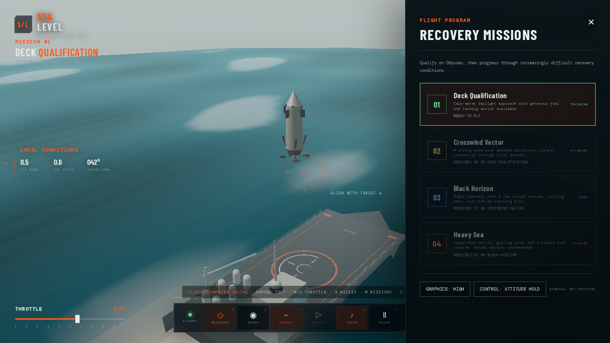
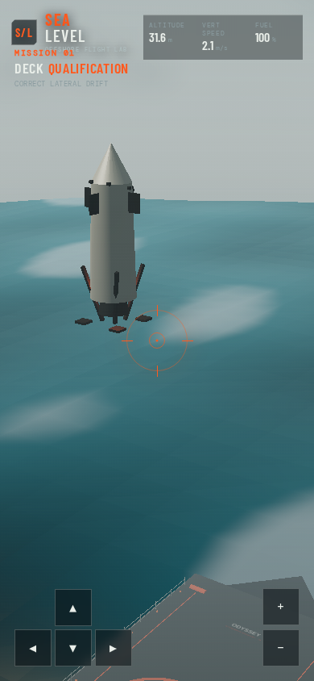
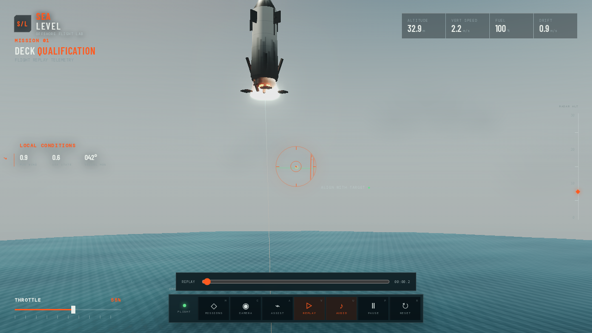

# SEA LEVEL

An interactive offshore booster-recovery simulator built with Three.js, TypeScript, and Vite. Fly a reusable stage onto the moving drone ship *Odyssey* while managing thrust, angular momentum, wind, fuel, deck motion, and landing-leg contact.

[](https://github.com/joewolly/rocket-simulation/actions/workflows/ci.yml)

> **Status:** public preview. SEA LEVEL is a playable visual simulator, not a flight-certified engineering or safety-analysis tool.

## What this is

SEA LEVEL keeps the flight rules deterministic and serializable while the Three.js layer renders the vehicle, ocean, weather, and moving deck. It is designed for browser play, control experimentation, and replayable landing challenges. The model intentionally simplifies real launch and recovery operations; do not use its output for vehicle design, operations, or safety decisions.

## Screenshots

The simulator adapts from a desktop flight deck to touch controls, with mission selection and flight replay built into the same loop.

<table>
  <tr>
    <td></td>
    <td></td>
  </tr>
  <tr>
    <td align="center">Desktop mission selection</td>
    <td align="center">Mobile touch controls</td>
  </tr>
</table>

<p align="center">
  
</p>

## Run locally

Requirements: a modern browser with WebGL enabled and Node.js `^20.19.0 || >=22.12.0` for local development.

```bash
npm install
npx playwright install --with-deps chromium  # first time only, for browser tests
npm run dev
```

Open the local URL printed by Vite. For production verification:

```bash
npm run verify
git diff --check
```

`npm run verify` runs the deterministic unit suite, desktop/mobile Playwright checks, and the production build. `npm run build` writes the static site to `dist/`; it can be served by any static hosting provider.

## Deploy

Use a static-site deployment with:

- **Build command:** `npm ci && npm run build`
- **Publish directory:** `dist`
- **Runtime:** no server or environment secrets required

The npm package is intentionally marked private because SEA LEVEL ships as a static site, not as an npm library.

The app is client-only. A deployment can use a custom domain or a root-path static host. If you deploy under a subpath, configure Vite's `base` option for that path before building and serve the generated `index.html` as the fallback document.

The production build keeps Three.js in a separately cacheable vendor chunk (currently about 523 kB minified / 130 kB gzip). Vite reports that chunk-size warning intentionally; future rendering work should reduce or reassess that cost before adding more large dependencies.

## Maintainer release checklist

- Confirm the repository visibility, branch protection, Issues, and private vulnerability reporting settings on GitHub.
- Choose a static host and verify the deployed root URL on desktop and touch hardware.
- Run `npm run verify` and `git diff --check` from the release commit.
- Tag the release and link the deployed simulator from the GitHub repository description.

## Data and privacy

There are no accounts, project-owned APIs, or server-side pilot records. Mission progress, personal-best scores, audio preference, and graphics preference are stored in the browser under the `sea-level-pilot-records-v2` local-storage key. Clearing site data resets them. Audio starts only after a user gesture and can be muted from the flight dock. The default stylesheet loads display fonts from Google Fonts; deployments that need to be fully self-contained should replace that import with bundled fonts or system fallbacks.

## Flight systems

- Fuel-dependent mass and thrust-to-weight ratio
- Engine gimbal slew, torque, angular velocity, and wind torque
- Deterministic gusting wind and mission-specific sea state
- Four independent landing-leg contact points
- Touchdown limits for vertical speed, drift, tilt, and angular rate
- Attitude-hold, direct-rate, and autonomous landing modes
- Procedural engine/wind/impact audio and gamepad haptics
- 20 Hz serializable flight recorder with camera-independent replay scrubbing
- Saved mission progression and personal best scores
- High/low graphics modes and responsive touch controls

## Missions

1. **Deck Qualification** — calm-water training approach
2. **Crosswind Vector** — strong lateral wind and reduced fuel
3. **Black Horizon** — night recovery with heavier deck motion
4. **Heavy Sea** — extreme swell, gusting wind, and narrow fuel margin

Complete each mission above its unlock threshold to open the next.

## Known limitations

- The flight and ocean models are intentionally simplified and tuned for a playable experience.
- Procedural vehicle and ship geometry are the reliable runtime fallback; production GLB assets are not included yet.
- WebGL is required; devices without a working WebGL context cannot render the simulator.
- Records are local to one browser profile and are not synchronized between devices.

## Controls

- Arrow keys: command pitch and roll
- `W` / `S`: increase or decrease throttle
- `Space` / `Left Shift`: alternate throttle controls
- `A`: toggle autonomous landing assist
- `Z`: switch attitude-hold/direct-rate control
- `C`: cycle chase, deck, and free-orbit cameras
- Drag and scroll in orbit camera mode
- `M`: mission and graphics panel
- `V`: replay the most recent flight
- `U`: mute/unmute audio
- `P` or `Escape`: pause/resume
- `R`: restart the approach
- Gamepad: left stick for pitch/roll and triggers for analog throttle
- Touch devices: on-screen flight pad and throttle buttons

## Architecture

- `src/simulation.ts`: deterministic flight and deck-contact state
- `src/game/autopilot.ts`: landing guidance controller
- `src/game/missions.ts`: scenario definitions and unlock requirements
- `src/game/input.ts`: analog gamepad mapping and haptics
- `src/game/audio.ts`: procedural Web Audio flight feedback
- `src/game/replay.ts`: serializable recorder and playback sampling
- `src/game/persistence.ts`: local pilot records and settings
- `src/render/assetManifest.ts`: stable GLB runtime contract
- `tests/simulation.test.ts`: deterministic physics regression suite
- `tests/e2e/simulation.spec.ts`: desktop, mobile, WebGL, touchdown, and replay QA

The simulation owns gameplay state independently of Three.js objects. Production vehicle and ship models should be optimized GLB files following [the runtime asset contract](assets/README.md); procedural models remain available as reliable fallbacks.

## Contributing and license

Development, testing, physics-boundary, and pull-request guidance is in [CONTRIBUTING.md](CONTRIBUTING.md). Please read [SECURITY.md](SECURITY.md) before reporting a vulnerability. SEA LEVEL is released under the [MIT License](LICENSE).
